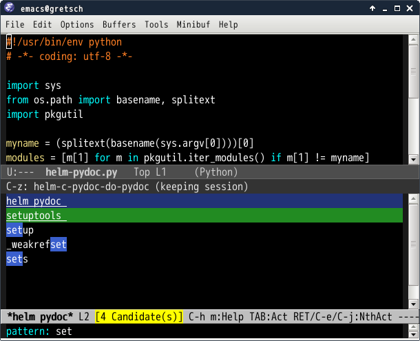
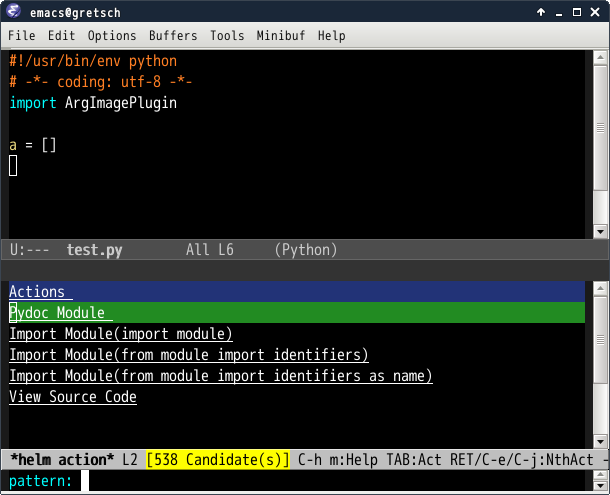

# helm-pydoc.el [![melpa badge][melpa-badge]][melpa-link] [![melpa stable badge][melpa-stable-badge]][melpa-stable-link]

## Introduction
`helm-pydoc.el` is pydoc helm interface


## Screenshot






## Requirements

* Emacs 24.3 or higher
* helm 1.7.4 or higher

## Installation

You can install `helm-pydoc.el` from [MELPA](https://melpa.org/) with `package.el`

```
 M-x package-install helm-pydoc
```


## Basic Usage

#### `helm-pydoc`

`pydoc` with helm interface

## Customize Variable

#### `helm-pydoc-virtualenv`(Default `"venv"`)

Directory name of virtualenv. Use virtualenv `python` if this name directory
is found in this directory hierarchy.

## Actions

* View module document
* View source code
* Import module statement
    * import module(Insert marked candidates)
    * from module import identifier
    * from module import identifier


## Sample Configuration

```lisp
(eval-after-load "python"
  '(progn
     (define-key python-mode-map (kbd "C-c C-d") 'helm-pydoc)))
```

[melpa-link]: https://melpa.org/#/helm-pydoc
[melpa-stable-link]: https://melpa.org/#/helm-pydoc
[melpa-badge]: https://melpa.org/packages/helm-pydoc-badge.svg
[melpa-stable-badge]: https://stable.melpa.org/packages/helm-pydoc-badge.svg
